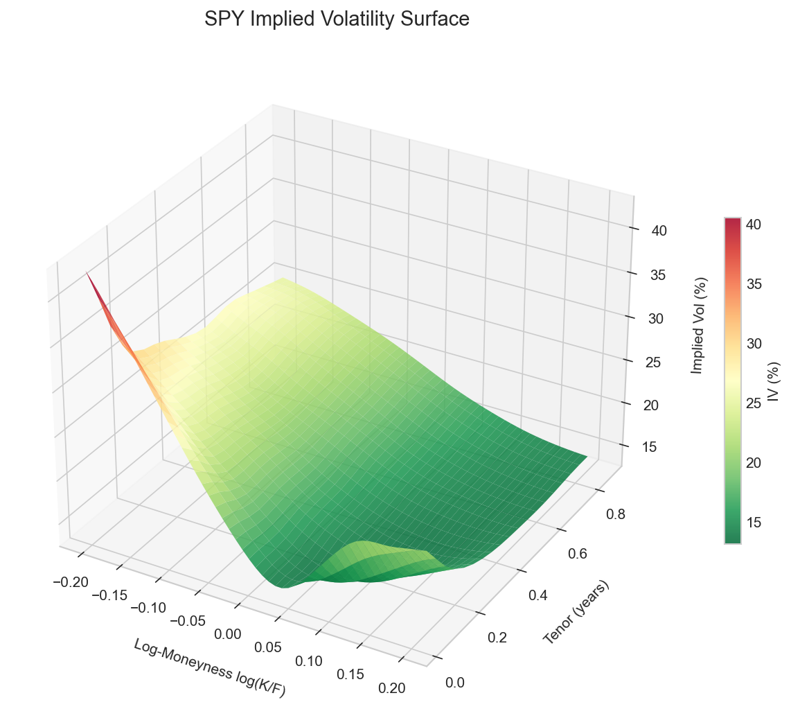
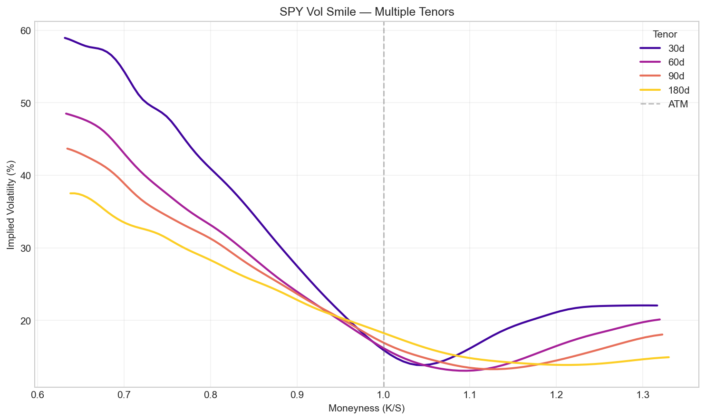
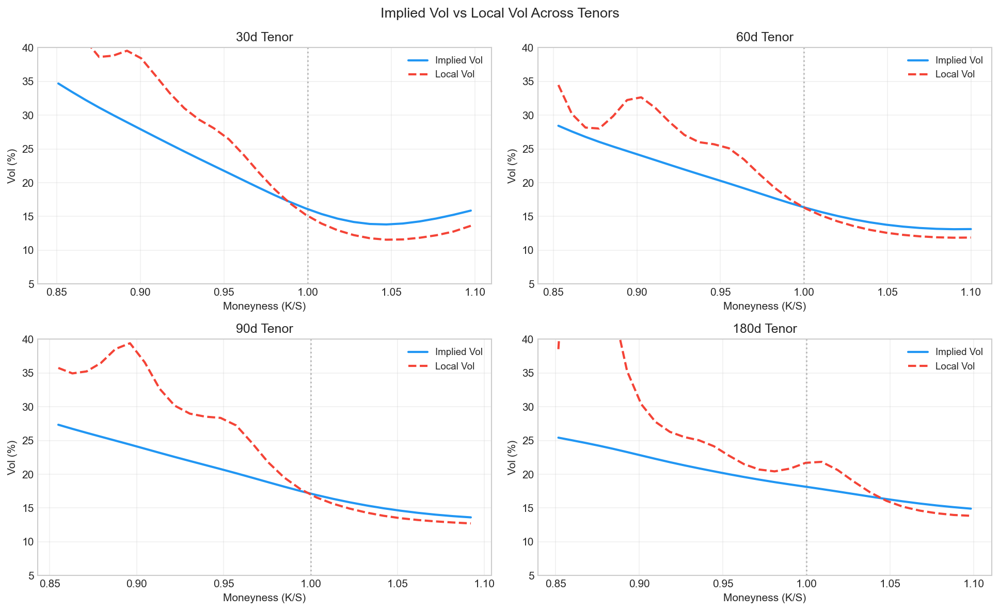
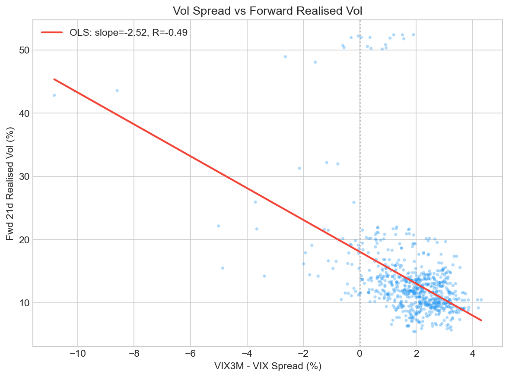
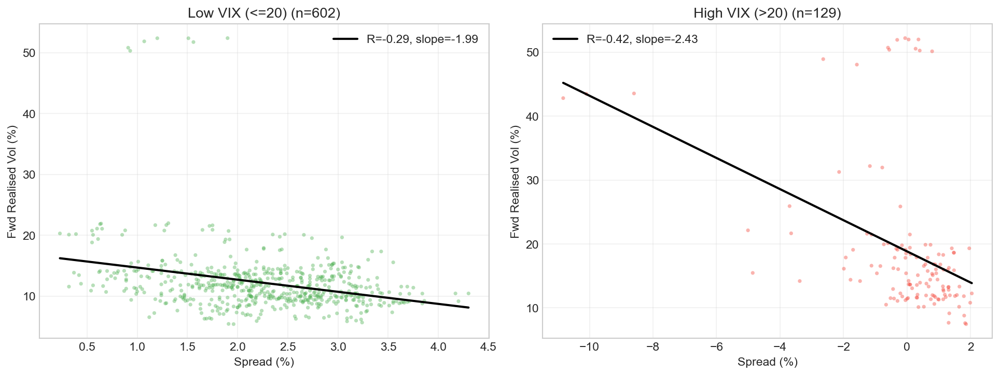

# equity-vol-surface


End-to-end implied and local volatility surface built from live SPY options data,
with a Dupire local volatility implementation and an empirical study showing that
the VIX term structure carries robust predictive content for next-month realised
volatility on SPY (R = −0.49, R² ≈ 0.24).

The focus is implementation fidelity and empirical sanity-checking.
Where the model breaks down — and Dupire on splined surfaces does break down —
the limitations are documented rather than hidden.

---

## Motivation

The Black-Scholes model prices options with a single volatility parameter.
Real markets disagree: identical underlyings trade at materially different
implied vols across strikes and expiries — the *volatility surface*.
This structure is not noise. The asymmetric skew in equity index options reflects
structural demand for downside protection, and the term structure of ATM vol
carries information about how uncertainty evolves over time.

This project asks: **does the spread between 3M and 1M ATM implied volatility
carry predictive content for subsequent realised volatility?**
The VIX/VIX3M pair is used as a tractable proxy for this study, since yfinance
does not provide historical option chains for full surface reconstruction.

---

## Project Structure

```
equity-vol-surface/
│
├── notebooks/
│   ├── 01_bsm_and_greeks.ipynb        BSM mechanics, Greeks, IV round-trip
│   ├── 02_vol_surface.ipynb           Surface construction and visualisation
│   ├── 03_local_vol_dupire.ipynb      Dupire local vol, IV vs LV comparison
│   └── 04_surface_vs_realised.ipynb   Empirical: term structure vs realised vol
│
├── src/
│   ├── bsm.py          Vectorised BSM: pricing, all Greeks, implied vol inversion
│   ├── surface.py      VolSurface: fetch → IV extraction → arb filter → smoothed spline
│   ├── local_vol.py    LocalVolSurface: Dupire equation via numerical differentiation
│   └── utils.py        Data fetching, realised vol, IV spread computation
│
├── tests/
│   ├── test_bsm.py     33 tests: put-call parity, boundary conditions, Greeks, IV round-trip
│   └── test_surface.py No-arbitrage checks (calendar spread, smile shape, smoke tests)
│
└── data/README.md      Data sources, access notes, known limitations
```

The `src/` modules are importable and independently testable.
Notebooks are the narrative layer; `src/` is the engine.

---

## Methodology

**1. Data**: SPY options chain via `yfinance`. Filters: 7–365 DTE, OI ≥ 100,
volume ≥ 10, bid > 0, moneyness within 60%–140% of spot.
Mid-price used as market price proxy.

**2. Implied vol extraction**: BSM inversion via Brent's method. Floors and ceilings
applied (1%–200%). Calendar-spread arbitrage filter: total variance σ²(K,T)·T must
be non-decreasing in T for fixed moneyness.

**3. Surface fitting**: 2D cubic spline in (log-moneyness, tenor) space.
A 2D Gaussian smoother (σ=1.0) is applied to the IV grid before spline fitting.
This was added after observing that raw spline fitting amplified small data
inconsistencies into wild local-vol artifacts; the smoother averages out
spurious curvature while preserving the macro shape (skew, smirk, term structure).

**4. Local vol (Dupire)**: numerical differentiation of the smoothed IV surface
in (K, T) space. The differentiation step is dK = 2% of strike, large enough that
spline residuals are averaged out but small enough to retain local curvature.
Computation is restricted to moneyness 0.85–1.10 — the liquid range for SPY —
to avoid extrapolation into illiquid wings where the surface is unreliable.

**5. Empirical study**: OLS regression of VIX3M–VIX spread on forward 21-day
realised vol over a 3-year window. Newey-West standard errors correct for
serial correlation from the overlapping forward windows. Regime split
(VIX ≤ 20 vs VIX > 20) tests whether predictive content varies by stress level.

---

## Key Results

### Implied Volatility Surface

The fitted surface captures the standard features of SPY vol: a pronounced
negative skew (put wing materially elevated above the call wing), and a term
structure that is typically upward sloping in calm regimes and inverted during
stress.



### Volatility Skew Across Tenors

Short-dated skews are steeper — near-term tail risk commands a higher premium.
The asymmetric shape (put wing materially elevated above the call wing) is
characteristic of equity index options and is often called a *smirk* rather
than a *smile*; a symmetric smile is more typical of FX markets where there is
no structural directional bias. The skew flattens as tenor increases,
consistent with mean-reversion in vol.



### Implied Vol vs Local Vol

In the liquid moneyness range (0.85–1.10), the local vol curve sits slightly
above the implied vol curve in the put wing and slightly below in the call wing —
the expected Dupire relationship. Outside this range, naive numerical Dupire
becomes unstable: the second derivative of the spline-interpolated call surface
amplifies any data inconsistencies into spurious local vol spikes. This is the
well-documented failure mode of spline-based Dupire and motivates production
systems' use of parametric implied vol surfaces (SVI, SABR) instead.



### Term Structure Predicts Realised Volatility

The VIX3M–VIX spread shows a robust **negative** correlation with next-month
realised vol on SPY: **R = −0.49, R² ≈ 0.24** in-sample over the three-year window.



The sign is economically meaningful: an *inverted* term structure today
(VIX > VIX3M, spread < 0) predicts elevated realised vol over the following
month. Inversions occur during stress regimes which tend to persist, hence the
predictive content.

The relationship is regime-sensitive but does not reverse:

|  Regime | n | R | Slope |
|---|---|---|---|
| Low VIX (≤ 20) | 602 | −0.29 | −1.99 |
| High VIX (> 20) | 129 | −0.42 | −2.43 |

In stressed regimes the predictive content is meaningfully stronger,
consistent with term structure information being more diagnostic when markets
are nervous. R² of ~0.18 in the high-VIX subsample is solid for vol forecasting,
though sample size is modest.



---

## How to Run

```bash
git clone https://github.com/ludovico-finance/equity-vol-surface
cd equity-vol-surface
python -m venv venv
source venv/bin/activate         # macOS/Linux (use venv/bin/activate.fish for fish shell)
pip install -r requirements.txt

# Run tests (33 tests across BSM and surface)
pytest tests/ -v

# Launch notebooks (run in order)
jupyter notebook notebooks/
```

**Dependencies**: `numpy`, `scipy`, `pandas`, `yfinance`, `matplotlib`, `statsmodels`.
See `requirements.txt` for pinned versions.

---

## Data & Limitations

- **Options data via yfinance** (free). Bid-ask spreads can be wide for illiquid
  strikes; mid-price is used as a market price proxy.
- **No historical options chains**: yfinance does not expose them. The empirical
  study therefore uses VIX/VIX3M as a constant-maturity proxy for the 1M/3M ATM
  spread. For a production-grade historical study, a paid data source
  (OptionMetrics, CBOE DataShop, or a prime broker feed) would be required.
- **Naive numerical Dupire is unstable in illiquid regions**. The Gaussian
  smoothing and moneyness restriction mitigate this but do not eliminate it.
  A parametric implied-vol surface (SVI) with analytical derivatives is the
  proper production-grade fix.
- **Newey-West standard errors are imperfect** for the overlapping-window setup
  in notebook 04; the regression should be read as exploratory rather than as
  the basis for a trading strategy.
- **yfinance options data is most reliable during US market hours**
  (roughly 14:30–21:00 UTC, weekdays). Outside these hours, bid/ask spreads
  widen and volume/open-interest can collapse to zero, causing the strict
  liquidity filters to remove all data. The notebook uses relaxed filters
  (min OI = 10, min volume = 0) so it runs in any timezone; the default
  filters in `src/surface.py` (min OI = 100, min volume = 10) are stricter
  and recommended for production use during market hours.

---

## Further Work

- **Calibrate an SVI parametric implied vol surface** and compare local vol stability
  vs the spline-based version
- **Calibrate a Heston stochastic volatility model** and compare full-surface fit quality
- **Cross-sectional extension** of the empirical study across multiple underlyings
  (sector ETFs, individual large-caps) to test whether the term-structure signal
  generalises
- **Out-of-sample test** of the predictor (e.g., 2023–2025 in-sample, 2026 held out)
  to confirm the relationship is not period-specific
- **Full static no-arbitrage check** (Roper 2010) replacing the heuristic
  calendar-spread filter

---

*Quant Research project | Python · NumPy · SciPy · yfinance · statsmodels*
